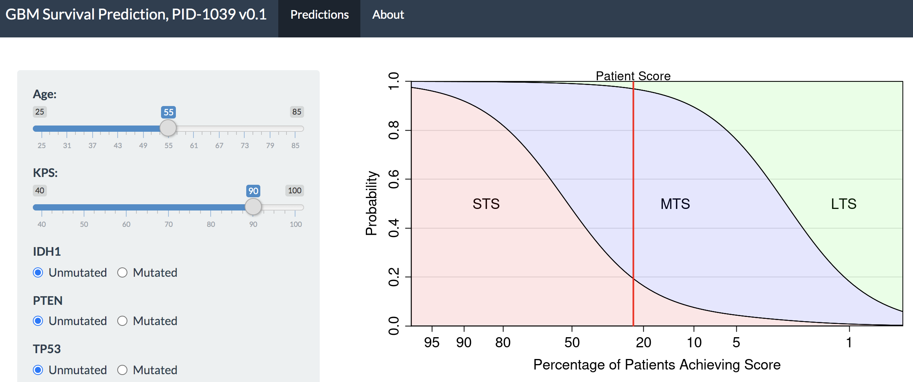

## Survival Prediction for GBM

Code for building a clinical and genomic predictive model (nomogram) for GBM survival. The resulting nomogram is available here [https://biostatistics.mdanderson.org/shinyapps/GBM_Predict/](https://biostatistics.mdanderson.org/shinyapps/GBM_Predict/).

This repository contains data cleaning, model construction, and validation code only, not the web-based nomogram itself. Due to data confidentiality issues, MD Anderson cohort data is not publicly available through this repository. As a result, the code in this repository cannot be executed. For access to the MD Anderson cohort data, please contact [Dr. Amy Heimberger](aheimber@mdanderson.org).

### Citation and Contact

This code was developed for and described in:

**[Ferguson, Sherise D., et al. "A validated integrated clinical and molecular glioblastoma long-term survival-predictive nomogram." Neuro-Oncology Advances (2020).](https://academic.oup.com/noa/advance-article/doi/10.1093/noajnl/vdaa146/5944711)**

Please cite that paper if you use this work.

Email [jplong@mdanderson.org](jplong@mdanderson.org) with code questions or bug reports.
